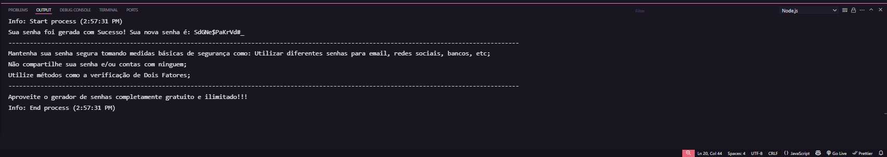

<h1 align="center"> Gerador de Senhas' </h1>

Programa feito com o propósito de gerar senhas seguras.  

  <a href="#-tecnologias">Tecnologias</a>&nbsp;&nbsp;&nbsp;|&nbsp;&nbsp;&nbsp;
  <a href="#-projeto">Projeto</a>&nbsp;&nbsp;&nbsp;|&nbsp;&nbsp;&nbsp;
  <a href="#memo-licença">Licença</a>

  

 

---

## 🚀 Tecnologias

Esse projeto foi desenvolvido com as seguintes tecnologias:

- JavaScript
- Node.Js
- Git
- GitHub

---

## 💻 Projeto

Um Gerador de Senhas básico feito com JavaScript puro rodando no terminal/Console (Node.Js), o programa ajuda os usuários a criarem senhas seguras para serem utilizadas em plataformas como Redes Sociais, Email, Cadastros em plataformas Online e muitos outros.
Programa com uso ilimitado e recomendado para todos os públicos, pois segurança digital é essencial e todos devem tomar medidas para se protegerem de invasões digitais.

---

## :memo: Licença

Esse projeto é de lincença livre.

---

Feito pelo desenvolvedor Gabriel Almeida :wave: [Entre em meu LinkedIn!](https://www.linkedin.com/in/gabrielalmeidadev/)
